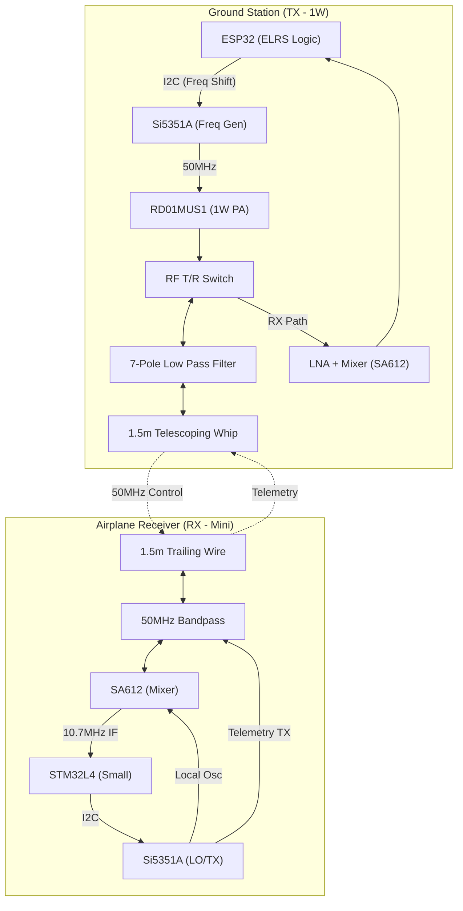

# 6m (50MHz) Amateur Radio RC Transceiver Design

This document details the design for a modern, high-performance 2-way digital radio control and telemetry system operating in the 50MHz (6-meter) Amateur Radio band.

## 1. Project Overview
- **Frequency Band**: 50.0 – 54.0 MHz (Target: 50.8 – 51.0 MHz RC Window).
- **Communication Type**: 2-Way Digital Link (Control + Telemetry).
- **Modulation**: GFSK (Gaussian Frequency Shift Keying).
- **Architecture**: Discrete RF (Si5351A + SA612) - Optimized for availability and long-term sustainability.

---

## 2. System Architecture

---

## 3. Key Components

### 3.1 RF & Logic
| Component | Part Number | Role | Description |
| :--- | :--- | :--- | :--- |
| **Frequency Gen** | [Si5351A-B-GT](https://www.silabs.com/timing/clock-generators/si5351-any-frequency-i2c-programmable-clock-generator) | TX & LO | Generates 50MHz carrier and handles FSK modulation via I2C register pulling. |
| **Power Amp** | [RD01MUS1](https://www.mitsubishielectric.com/semiconductors/content/product/highfrequency/rfmosfet/rd01mus1.pdf) | TX Boost | 1W VHF Silicon MOSFET. Provides robust range for the ground link. |
| **Mixer** | [SA612AD](https://www.nxp.com/products/rf/rf-mixers-and-converters/double-balanced-mixer-and-oscillator:SA612A) | Receiver | Double-balanced mixer for 50MHz to 10.7MHz down-conversion. |
| **LNA** | [SPF5043Z](https://www.qorvo.com/products/p/SPF5043Z) | Front-End | Low-noise amplifier to maximize sensitivity. |

### 3.2 Microcontrollers
- **Ground Station**: **ESP32-S3**. Powerful enough to run the ExpressLRS (ELRS) stack, with integrated WiFi for smartphone configuration and firmware updates.
- **Airplane RX**: **STM32L412**. Ultra-low power ARM Cortex-M4. Handles 10.7MHz IF sampling and FSK demodulation in software.

---

## 4. Design Specifics

### 4.1 FSK Modulation Technique
The Si5351A is modulated by the MCU updating the `MSx_P1`, `MSx_P2`, and `MSx_P3` registers over I2C.
- **Center Frequency**: 50.800 MHz.
- **Deviation**: ±2.4 kHz (for standard GFSK).
- **Update Rate**: For a 2400 baud link, the registers should be updated at approximately 10kHz to ensure smooth frequency transitions (GFSK).

### 4.2 Receiver Intermediate Frequency (IF)
The receiver uses a single-conversion superheterodyne approach:
- **RF Input**: 50.800 MHz.
- **Local Oscillator (LO)**: 39.300 MHz (from Si5351A).
- **IF Output**: 11.500 MHz (or 10.7MHz with adjusted LO).
- **Selectivity**: Use a standard 10.7MHz Ceramic Filter (230kHz BW) followed by an MCU-based Digital Signal Processing (DSP) stage.

### 4.3 1W Power Amplifier (PA)
The RD01MUS1 requires a simple matching network:
- **Input Match**: Typically a 4:1 or 9:1 transformer to match the low input impedance of the MOSFET.
- **Output Match**: A Pi-network or L-network designed for 50 Ohm load at 50MHz.
- **Low Pass Filter**: A 7-pole Butterworth filter is mandatory to suppress the 100MHz (2nd) and 150MHz (3rd) harmonics to >60dBc.

---

## 5. Antennas
- **Airplane (RX)**: 1.5m (59 inches) 1/4 wave trailing wire. Must be routed away from ESCs, motors, and carbon fiber components.
- **Ground Station (TX)**: 1.5m telescoping whip. For maximum performance, include a 1.5m "tiger tail" counterpoise wire connected to the module ground.

---

## 6. Implementation Notes & Best Practices

> [!IMPORTANT]
> **Licensing**: Operating this system requires a valid Amateur Radio License. Ensure your callsign is programmed into the telemetry data packets to comply with "Automatic Identification" regulations.

> [!WARNING]
> **Thermal Management**: The RD01MUS1 at 1W output is roughly 50-60% efficient, meaning it dissipates ~1W of heat. Use a large ground plane and thermal vias on the PCB to wick heat away.

> [!TIP]
> **Firmware**: Modeling the packet structure after **ExpressLRS (ELRS)** is highly recommended. It provides industry-leading latency and interference rejection.

---

## 7. Verification Plan
1. **Spectral Purity**: Verify harmonic emissions are below -60dBc using a spectrum analyzer.
2. **Frequency Stability**: Test the TCXO/Crystal over temperature to ensure the 50MHz carrier doesn't drift outside the IF filter bandwidth.
3. **Range Test**: Conduct a ground-range test. 1W at 50MHz should provide over 10km of line-of-sight range under ideal conditions.
