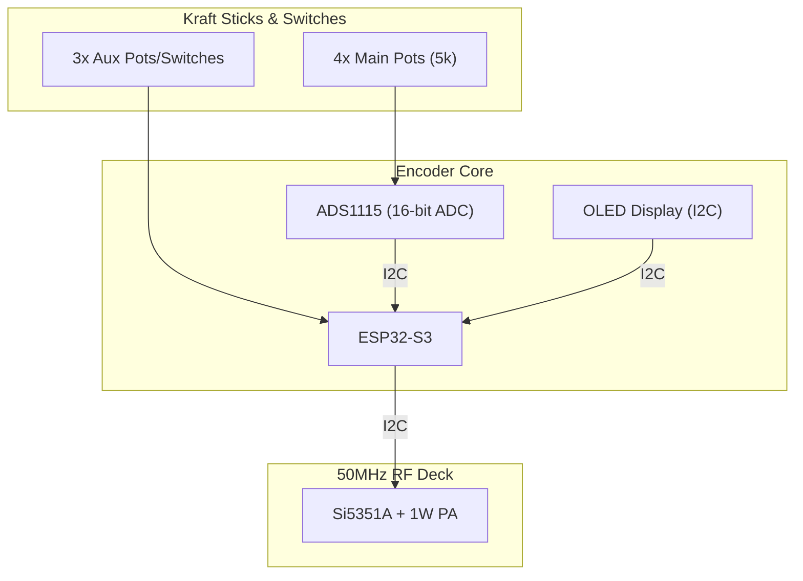

# Digital Encoder Conversion (Kraft 7 Restomod)

This guide details how to replace the legacy analog electronics of a Kraft 7 transmitter with a modern, high-precision digital encoder based on the **ESP32**.

## 1. Concept
We strip out the original Kraft encoder board but keep the high-quality aluminum stick gimbals and the case. The ESP32 becomes the "brain," reading the stick positions digitally and driving the 50MHz RF deck.

## 2. Hardware Architecture

### 2.1 Stick Input (High Precision)
The original Kraft sticks use 5k or 10k potentiometers. While the ESP32 has internal ADCs, they are often too noisy for smooth RC control.
- **Recommended ADC**: **ADS1115** (16-bit I2C ADC).
- **Wiring**:
  - Connect the top and bottom of all stick pots to the ESP32's **3.3V** and **GND**.
  - Connect the center wipers of the 4 main axes (Ail, Ele, Thr, Rud) to the ADS1115 inputs (A0-A3).
  - Connect the remaining 3 auxiliary channels to the ESP32's internal ADC pins (GPIO 32-34).

### 2.2 User Interface (OLED Display)
To make the transmitter truly modern, add a small display:
- **Part**: 1.3" I2C OLED (SH1106 or SSD1306).
- **Features**:
  - Live Telemetry (Airplane battery, Signal strength).
  - Stick Calibration menu.
  - Model Memory (Store settings for multiple planes).

---

## 3. Wiring Diagram

---

## 4. Software Features (Firmware)

### 4.1 Calibration & Deadband
Digital sticks require a calibration routine to find the physical center and endpoints.
- **Deadband**: Small software buffer at the center (e.g., ±10 units) to prevent "servo jitter" when hands are off the sticks.

### 4.2 Exponential & Dual Rates
Implement modern flight feel:
- **Expo**: Softens the center of the sticks for smoother flying.
- **Dual Rates**: Toggle switch to reduce maximum throw for beginners or high-speed flight.

### 4.3 Telemetry Feedback
Since the link is 2-way, the ESP32 will receive telemetry packets from the airplane 50MHz receiver and update the OLED display in real-time.

---

## 5. Implementation Steps
1. **Gut the Kraft**: Remove the old PCB and wiring, leaving only the pots and the battery box.
2. **Mount the ESP32**: Use the space where the old RF deck sat.
3. **Wire the Pots**: Ensure clean, shielded wiring for the analog signals to prevent interference from the 1W PA.
4. **Flash Firmware**: Use the ExpressLRS-based logic adapted for the ADS1115 input.

---
*Note: This conversion turns a 50-year-old radio into a state-of-the-art digital 6-meter system.*
