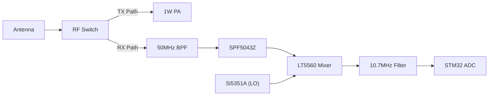

# 6m RC Receiver Design Details (SA612/LT5560)

This document describes the design of the high-sensitivity receiver for the 50MHz RC link, focusing on the mixer and Intermediate Frequency (IF) stage.

## 1. Front-End (LNA)
- **Component**: **SPF5043Z** MMIC.
- **Function**: Provides ~15dB of gain with a very low noise figure (< 0.8dB).
- **Matching**: Requires a simple inductor/capacitor match for 50MHz at the input and output.
- **Protection**: A pair of BAV99 diodes should be placed at the input to protect the LNA from high-power pulses if the T/R switch fails.

---

## 2. Mixer Stage (Down-Converter)
We have selected the **LT5560** as a modern, high-performance replacement for the obsolete SA612.

- **RF Input**: 50.800 MHz (from LNA).
- **LO Input**: 40.100 MHz (from Si5351A).
- **IF Output**: 10.700 MHz.
- **Conversion Gain**: ~2dB (Active Mixer).
- **Logic**: The LT5560 is a Gilbert-cell based active mixer, similar in topology to the SA612 but with much higher IP3 (linearity).

---

## 3. IF Filtering & Demodulation
- **IF Frequency**: 10.7 MHz.
- **Filter**: 10.7MHz Ceramic Filter (Standard 230kHz bandwidth). This provides the primary selectivity to reject out-of-band interference.
- **Demodulation**: The 10.7MHz signal is fed into the STM32L4's ADC.
    - **Sampling**: The MCU samples the 10.7MHz signal (using undersampling techniques or a high-speed ADC clock).
    - **DSP**: A Software-Defined Radio (SDR) algorithm in the MCU performs:
        1. **Digital Down-Conversion (DDC)** to Baseband.
        2. **FM/FSK Demodulation** via a quadrant discriminator or PLL-based approach.

---

## 4. T/R Switching
To protect the receiver during 1W transmission:
- **Component**: **BGS12PL6** RF Switch.
- **Isolation**: > 30dB at 50MHz.
- **Switching Speed**: < 1us (Critical for fast telemetry turnaround).

---

## 5. Summary Schematic Diagram

---
*Reference: Analog Devices LT5560 Datasheet & Software Defined Radio (SDR) Demodulation Principles.*
