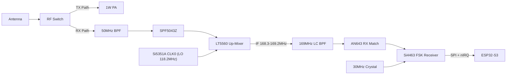

# 6m RC Receiver Design Details (LT5560 + Si4463)

This document describes the design of the high-sensitivity receiver for the 50MHz RC link, focusing on the mixer and Intermediate Frequency (IF) stage.

## 1. Front-End (LNA)
- **Component**: **SPF5043Z** MMIC.
- **Function**: Provides ~15dB of gain with a very low noise figure (< 0.8dB).
- **Matching**: Requires a simple inductor/capacitor match for 50MHz at the input and output.
- **Protection**: A pair of BAV99 diodes should be placed at the input to protect the LNA from high-power pulses if the T/R switch fails.

---

## 2. Mixer Stage (Up-Converter)
The **LT5560** active mixer is kept, but it now **up-converts** the 6m signal to a VHF IF
instead of down-converting to 10.7MHz (see section 3 for why).

- **RF Input**: 50.100 - 51.000 MHz (from LNA / 50MHz BPF).
- **LO Input**: **118.200 MHz, fixed** (Si5351A CLK0, on its own PLL -- PLLA 709.2MHz, integer MultiSynth /6).
- **IF Output**: **IF = RF + LO** -> 168.300 - 169.200 MHz (US RC channels 50.800-50.980 -> 169.000-169.180 MHz).
  Sum mixing, so there is no spectral inversion: an FSK mark stays a mark.
- **Output network**: must now be tuned for ~169MHz rather than 10.7MHz. Both open-collector IF
  outputs need a DC path to VCC -- follow the LT5560 datasheet output network.
- **Spurs / image**: image = IF + LO ~ 287MHz; the 2xRF - LO = IF response sits at ~143.6MHz.
  Both are removed by the 50MHz BPF ahead of the mixer. LO (118.2MHz) and RF (50MHz)
  feedthrough are removed by the IF band-pass and the Si4463's own channel filter.

---

## 3. IF Filtering & Demodulation -- Si4463 packet receiver
- **IF Filter**: 3-pole LC band-pass, centre ~168.75MHz, ~3-5MHz bandwidth, 50 ohm (values TBD --
  design and verify with SPICE). Replaces the Murata SFE10.7 ceramic filter. It only needs to
  pass the hop band and reject LO/RF feedthrough; channel selectivity is done inside the Si4463.
- **Demodulator**: **Si4463-C2A-GM** (Silicon Labs EZRadioPRO, QFN-20, **active part**), used as
  a **receive-only** 2(G)FSK packet receiver at the 169MHz IF. Frequency range 142-1050MHz, so it
  cannot tune 50MHz directly -- hence the up-converter.
  - **RF input**: RXp/RXn through the differential LNA match from Silicon Labs AN643 (169MHz values).
  - **Reference**: its own **30.000MHz crystal** (internal tunable load caps, `GLOBAL_XO_TUNE`),
    not shared with the Si5351A, to keep LO spurs off the reference.
  - **Host interface**: SPI (<=10MHz, mode 0) + nIRQ + SDN to the ESP32-S3.
  - **Does in hardware**: channel filtering, demodulation, **AFC**, preamble + sync-word (0x1D4A)
    detection, packet FIFO, **RSSI**. Firmware only reads the 22-byte payload, checks CRC8 and
    drives the servos.
  - **Frequency hopping**: the LO stays fixed; each hop is just `START_RX` on the next Si4463
    channel number -- no Si5351 retuning or I2C traffic on the receive side.
- **Frequency error budget** (worst case, +-20ppm parts): TX carrier ~1kHz + LO ~2.4kHz + Si4463
  XO ~3.4kHz = ~6.8kHz -- more than the +-5kHz deviation. **Enable the Si4463 AFC**, and/or trim
  at build (Si5351 correction factor + `GLOBAL_XO_TUNE`).
- **IF choice**: 169MHz isn't an empty band anywhere (US land-mobile/paging nearby, EU 169.4MHz
  metering), so keep the IF section compact and shielded. If a local interferer shows up, the IF
  can be moved anywhere in ~142-200MHz with the LO kept <= ~150MHz.

  **Revision history -- why not the earlier approaches:**
  1. *IF undersampling (original)*: the ESP32-S3 ADC is capped at 83.3kSPS
     (`SOC_ADC_SAMPLE_FREQ_THRES_HIGH`), ~30x too slow for the 230kHz-wide 10.7MHz IF.
  2. *Single-chip FM-IF detectors* (MC3361/MC3372, SA604A, NJM2211): all obsolete (checked 2026-09-22).
  3. *CD74HC4046A PLL discriminator* (2026-09-22 revision): the HC4046 VCO is marginal at
     10.7MHz on 3.3V, needs a limited IF, and gives no AFC/RSSI/sync/CRC -- all left to firmware.
  4. *AX5043* (native 27-1050MHz, no conversion needed): out of production.
  5. *CC1101*: 300MHz minimum would need an LO > 250MHz, beyond the Si5351A's ~200MHz range.

---

## 4. T/R Switching
To protect the receiver during 1W transmission:
- **Component**: **BGS12PL6** RF Switch.
- **Isolation**: > 30dB at 50MHz.
- **Switching Speed**: < 1us (Critical for fast telemetry turnaround).

---

## 5. Summary Schematic Diagram

---
*Reference: Analog Devices LT5560 Datasheet; Silicon Labs Si4464/63/61/60 Datasheet and AN643 (Si446x RX LNA matching).*
