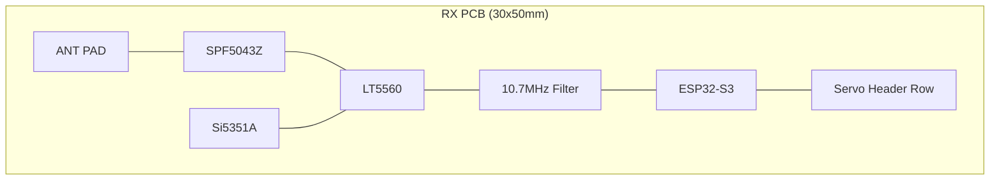

# 50MHz Receiver PCB Design Guide

This document provides technical guidance for laying out the custom 50MHz receiver PCB for aircraft installation.

## 1. Physical Specifications
- **Form Factor**: Target size of **30mm x 50mm**.
- **Mounting**: 4x M2 mounting holes at the corners.
- **Connectors**:
    - **RF In**: Single pin/solder pad for 1.5m wire antenna (or U.FL connector).
    - **Servo Out**: 4 to 8 standard 3-pin 0.1" male headers.
    - **Power In**: 5V from ESC (via servo rail).

---

## 2. PCB Stackup (4-Layer Recommended)
RF sensitivity at 50MHz requires a stable ground reference.
- **Layer 1 (Top)**: RF signal traces, LNA, Mixer, and IF Filter.
- **Layer 2 (Internal)**: **Solid Ground Plane** (No signal traces).
- **Layer 3 (Internal)**: Power Planes (3.3V for ESP32, 5V for Servos).
- **Layer 4 (Bottom)**: Ground Plane and low-speed digital signals (PWM).

---

## 3. Component Placement & Partitioning

To maximize sensitivity, the board must be split into three distinct zones:

### 3.1 Zone A: RF Front-End (High Sensitivity)
- Place the **SPF5043Z LNA** as close to the antenna input as possible.
- Keep the path to the **LT5560 Mixer** short and direct.
- **Isolation**: Use a ground pour "moat" around the LNA section to keep digital noise out.

### 3.2 Zone B: IF & LO (Frequency Synthesis)
- Place the **Si5351A** and its 26MHz crystal in the center.
- Route the LO signal to the Mixer using a short, impedance-controlled trace.
- The **10.7MHz Ceramic Filter** should be placed immediately after the Mixer output.

### 3.3 Zone C: Digital & Servos (High Current)
- Place the **ESP32-S3** at the far end of the board, away from the LNA.
- The **Servo Headers** should be at the edge of the board.
- **Bulk Capacitance**: Place a large (470uF) electrolytic capacitor near the servo power input to buffer current spikes.

---

## 4. RF Layout Principles

### 4.1 Trace Impedance
- All RF traces (Antenna to LNA, LNA to Mixer) should be calculated for **50 Ohm Impedance**.
- For a standard 1.6mm 4-layer board (Top to L2 ground), this is typically a **0.35mm** wide trace.

### 4.2 Ground Stitching
- Use a "Via Wall" (vias spaced 2-3mm apart) along the edges of the RF traces and around the LNA section to prevent EMI leakage.
- Ensure every ground pad on the LT5560 and SPF5043Z has at least 2 vias directly to the Layer 2 ground plane.

---

## 5. Physical Layout Concept (Floorplan)

---

## 6. Power Supply
- Use a high-quality **3.3V LDO** (e.g., AP2112) to power the ESP32 and RF chips from the 5V servo rail.
- Add an **LC Filter** (inductor + capacitor) on the 3.3V line feeding the LNA to block digital switching noise from the ESP32.

---
*Reference: Analog Devices RF Layout Best Practices & ESP32-S3 Hardware Design Guidelines.*
