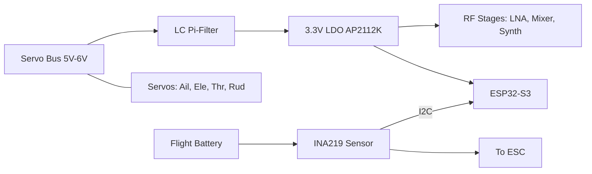

# 50MHz Receiver: Power Supply Design

This document describes the power distribution system for the aircraft-side receiver, converting high-current servo power to stable RF-grade 3.3V logic.

## 1. Power Source (BEC/ESC)
The receiver does not have its own battery. It draws power from the **5V or 6V rail** provided by the Electronic Speed Controller (ESC) or a standalone Battery Eliminator Circuit (BEC) via any of the servo headers.

- **Input Range**: 4.5V to 7.0V (Standard RC Servo Bus).
- **Current Requirement**: ~150mA (ESP32-S3 + RF stages) + Servo loads.

---

## 2. Power Architecture

---

## 3. Voltage Regulation (3.3V)
We use a high-quality **Low Dropout Regulator (LDO)** instead of a switching buck converter to prevent switching noise from interfering with the sensitive 50MHz LNA.

### 3.1 Component: AP2112K-3.3
- **Output**: 3.3V @ 600mA.
- **Why**: Excellent ripple rejection and very low noise.

---

## 4. RF Noise Isolation
Servos generate significant "inductive kickback" and electrical noise. To protect the RF sensitivity, we implement two levels of filtering:

### 4.1 Input LC Filter (The "Moat")
A Pi-filter at the input of the LDO prevents servo noise from entering the logic rails.
- **L1**: 10 uH Power Inductor (0805 or 1206).
- **C1/C2**: 10 uF Ceramic Capacitors.

### 4.2 Local Decoupling
Each RF chip (SPF5043Z, LT5560) must have its own 10nF + 100pF capacitor pair located within 2mm of the VCC pin.

---

## 5. Reverse Polarity Protection
RC connectors can sometimes be plugged in backwards.
- **Protection**: A **Schottky Diode (e.g., SS14)** should be placed in series with the 5V input to the LDO to prevent magic smoke if the ESC is connected incorrectly.

---

## 6. Telemetry Monitoring (INA219)
To send battery status back to the ground station, an **INA219 I2C sensor** is placed in-line with the main flight battery.
- **V_BATT Monitoring**: Measures the 2S-4S LiPo voltage.
- **Current Monitoring**: Measures the total current draw of the propulsion system.
- **Interface**: Connects to the ESP32-S3 via the same I2C bus as the Si5351A.

---

## 7. Wiring Summary

| Point | Connection | Purpose |
| :--- | :--- | :--- |
| **Servo Rail (+)** | To Diode Anode | Main Power In |
| **Diode Cathode** | To LC Filter In | Protected Power |
| **LDO Vout** | To ESP32 & RF VCC | Clean 3.3V |
| **INA219 IN+** | To Battery (+) | Current Sensing In |
| **INA219 IN-** | To ESC (+) | Current Sensing Out |
| **Common GND** | Ground Plane | Return Path |

---
*Note: Ensure the ground plane under the LDO is solid to act as a small heatsink.*
