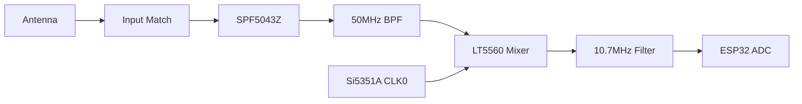

# 50MHz Receiver: KiCad Schematic Blueprint

## Visual Schematic Reference

## 1. Functional Block Diagram

---

## 2. Component Netlist (Pin-to-Pin)

### 2.1 RF Front-End (LNA)
**IC: SPF5043Z (SOT-343)**

| Pin | Name | Connection | Note |
| :--- | :--- | :--- | :--- |
| 1 | RFin | To Antenna (via 100pF Cap) | 50 Ohm Trace |
| 2 | GND | Ground Plane | Use multiple vias |
| 3 | RFout/VCC | To Mixer (via 100pF Cap + RFC) | Power fed via Inductor |
| 4 | GND | Ground Plane | |

### 2.2 Mixer Stage
**IC: LT5560 (DFN-8)**

| Pin | Name | Connection | Note |
| :--- | :--- | :--- | :--- |
| 1 | IN+ | From LNA Output (C_coupling) | RF Input |
| 2 | IN- | AC Ground (100pF to GND) | |
| 3 | EN | ESP32 GPIO (RX_EN) | Logic High to Enable |
| 4 | VCC | 3.3V Rail | Decouple with 10nF |
| 5 | OUT+ | To 10.7MHz Filter | IF Output |
| 6 | OUT- | AC Ground (10nF to GND) | |
| 7 | LO+ | From Si5351A CLK0 | Local Oscillator |
| 8 | LO- | AC Ground (100pF to GND) | |

### 2.3 Synthesizer
**IC: Si5351A (MSOP-10)**

| Pin | Name | Connection | Note |
| :--- | :--- | :--- | :--- |
| 1 | VDD | 3.3V Rail | Decouple 0.1uF |
| 2 | XA | 26MHz Crystal | |
| 3 | XB | 26MHz Crystal | |
| 4 | SCL | ESP32 GPIO 9 | I2C Clock |
| 5 | SDA | ESP32 GPIO 8 | I2C Data |
| 6 | CLK0 | To LT5560 Pin 7 | LO Output |

### 2.4 Power Supply (3.3V Regulator)
**IC: AP2112K-3.3 (SOT-23-5)**

| Pin | Name | Connection | Note |
| :--- | :--- | :--- | :--- |
| 1 | VIN | From Servo 5V (via SS14 Diode) | LC Filtered |
| 2 | GND | Ground Plane | |
| 3 | EN | Connect to VIN | Always On |
| 4 | NC | Not Connected | |
| 5 | VOUT | 3.3V Logic Rail | Decouple 10uF |

---

## 3. Passive Component Values (50MHz)

| RefDes | Value | Purpose |
| :--- | :--- | :--- |
| **C_coupl** | 100 pF | DC Blocking (RF Path) |
| **L_match** | 220 nH | Input Matching for 50MHz |
| **C_decoup** | 10 nF | High-frequency bypassing |
| **RFC** | 1.0 uH | RF Choke for LNA Power |
| **IF_FILT** | 10.7 MHz | Ceramic Filter (Murata SFE series) |

---

## 4. KiCad Library Suggestions
- **ESP32-S3**: Use the `Espressif` official KiCad library.
- **Si5351A**: Found in the `RF_Synthesizer` library.
- **SPF5043Z**: You may need to create a custom SOT-343 symbol, or use a generic 4-pin LNA symbol.
- **LT5560**: Use a generic `DFN-8-1EP_2x2mm` footprint.

## 5. Next Steps in KiCad
1.  **Symbols**: Add the ESP32-S3 and Si5351A from the standard libraries.
2.  **Custom Symbols**: Create the LT5560 and SPF5043Z symbols using the pin tables above.
3.  **Hierarchy**: Use **Global Labels** for `3.3V`, `GND`, `SDA`, and `SCL` to keep the schematic clean.
4.  **Grounding**: Ensure the **Exposed Pad (EP)** on the LT5560 is connected to the GND net.

---
*Created for the 6m RC Receiver Build.*
