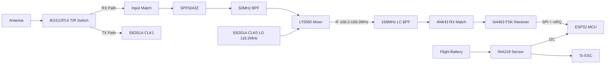

# 50MHz Receiver: KiCad Schematic Blueprint

## Visual Schematic Reference

## 1. Functional Block Diagram

```mermaid
graph LR
    ANT[Antenna] --> SW[BGS12PL6 T/R Switch]
    SW -- RX Path --> LNA_MATCH[Input Match]
    LNA_MATCH --> LNA[SPF5043Z]
    LNA --> BPF[50MHz BPF]
    BPF --> MIX[LT5560 Mixer]
    LO[Si5351A CLK0 LO 118.2MHz] --> MIX
    SW -- TX Path --> TELEM_DRIVE[Si5351A CLK1]
    MIX -- "IF 168.3-169.2MHz" --> IF_FILT[169MHz LC BPF]
    IF_FILT --> RXMATCH[AN643 RX Match]
    RXMATCH --> SI4463[Si4463 FSK Receiver]
    SI4463 -- SPI + nIRQ --> ESP
    BATT[Flight Battery] --> INA[INA219 Sensor]
    INA --> ESC[To ESC]
    INA -- I2C --> ESP[ESP32 MCU]
```

---

## 2. Component Netlist (Pin-to-Pin)

### 2.1 RF Switch (T/R Switch)
**IC: BGS12PL6 (TSLP-6)**

| Pin | Name | Connection | Note |
| :--- | :--- | :--- | :--- |
| 1 | RF2 | To Si5351A CLK1 (via 100pF) | Telemetry TX Path |
| 2 | GND | Ground Plane | |
| 3 | RF1 | To LNA Match Input | Control RX Path |
| 4 | CTRL | ESP32 IO10 (TR_SW) | High = TX, Low = RX |
| 5 | ANT | To Antenna Header | 50 Ohm Port |
| 6 | VDD | 3.3V Rail | Decouple with 0.1uF |

### 2.2 RF Front-End (LNA)
**IC: SPF5043Z (SOT-343)**

| Pin | Name | Connection | Note |
| :--- | :--- | :--- | :--- |
| 1 | RFin | From Switch RF1 (via 100pF) | 50 Ohm Trace |
| 2 | GND | Ground Plane | Use multiple vias |
| 3 | RFout/VCC | To Mixer (via 100pF Cap + RFC) | Power fed via Inductor |
| 4 | GND | Ground Plane | |

### 2.3 Mixer Stage (up-converter, 50MHz -> 169MHz IF)
**IC: LT5560 (DFN-8)**

| Pin | Name | Connection | Note |
| :--- | :--- | :--- | :--- |
| 1 | IN+ | From LNA Output (C_coupling) | RF Input |
| 2 | IN- | AC Ground (100pF to GND) | |
| 3 | EN | ESP32 IO21 (RX_EN) | Logic High to Enable |
| 4 | VCC | 3.3V Rail | Decouple with 10nF |
| 5 | OUT+ | To 169MHz IF BPF (via output match) | IF Output, ~169MHz; DC path to VCC per LT5560 datasheet |
| 6 | OUT- | AC Ground (10nF to GND) | Also needs its DC path to VCC (open collector) |
| 7 | LO+ | From Si5351A CLK0 | Local Oscillator, 118.200MHz fixed |
| 8 | LO- | AC Ground (100pF to GND) | |

### 2.4a IF Band-Pass Filter (replaces 10.7MHz ceramic filter)
3-pole LC band-pass, 50 ohm, centre ~168.75MHz, ~3-5MHz bandwidth (passes 168.3-169.2MHz).
Rejects LO (118.2MHz) and RF (50MHz) feedthrough from the mixer. Values TBD -- design and
verify with SPICE before layout.

### 2.4b FSK Packet Receiver
**IC: Si4463-C2A-GM (QFN-20, 4x4mm, exposed pad)** -- see `RX_Design_Details.md` section 3.
Receive-only: the TX and TXRAMP pins are left open and the chip is never put in TX state.
Replaces the CD74HC4046APWR PLL discriminator and the IF/baseband-to-ADC path (`ADC_IF` on IO4 is deleted).

| Pin | Name | Connection | Note |
| :--- | :--- | :--- | :--- |
| 1 | SDN | ESP32 IO18 (SI_SDN) | High = shutdown; drive low to run |
| 2 | RXp | From IF BPF via RX match | Differential LNA match per Silicon Labs AN643 (169MHz) |
| 3 | RXn | From IF BPF via RX match | |
| 4 | TX | Not Connected | Receive-only |
| 5 | NC | Not Connected | |
| 6 | VDD | 3.3V Rail | Decouple 100nF + 1uF |
| 7 | TXRAMP | Not Connected | Receive-only |
| 8 | VDD | 3.3V Rail | Decouple 100nF + 1uF (+10pF close to the pin) |
| 9 | GPIO0 | Test point | Optional RX_STATE |
| 10 | GPIO1 | Test point | Optional CTS (CTS is also polled over SPI) |
| 11 | nIRQ | ESP32 IO17 (SI_nIRQ) | Open drain, 10k pull-up to 3.3V |
| 12 | SCLK | ESP32 IO12 (FSPICLK) | SPI <=10MHz, mode 0 |
| 13 | SDO | ESP32 IO13 (FSPIQ) | MISO |
| 14 | SDI | ESP32 IO11 (FSPID) | MOSI |
| 15 | nSEL | ESP32 IO14 | Chip select (software-driven via GPIO matrix; IO10 is the T/R switch CTRL) |
| 16 | XOUT | 30.000MHz Crystal | Internal load caps (`GLOBAL_XO_TUNE`), no external caps |
| 17 | XIN | 30.000MHz Crystal | |
| 18 | GND | Ground Plane | |
| EP | GND | Ground Plane | Via-stitched exposed pad |

ESP32 pins: FSPI IOMUX pins for SCLK/MOSI/MISO, with CS on IO14 because IO10 is the T/R switch
CTRL. As captured in `RX_50MHz_SDR.kicad_sch` (U9) on 2026-09-28.

### 2.4 Synthesizer
**IC: Si5351A (MSOP-10)**

| Pin | Name | Connection | Note |
| :--- | :--- | :--- | :--- |
| 1 | VDD | 3.3V Rail | Decouple 0.1uF |
| 2 | XA | 26MHz Crystal | |
| 3 | XB | 26MHz Crystal | |
| 4 | SCL | ESP32 GPIO 9 | I2C Clock |
| 5 | SDA | ESP32 GPIO 8 | I2C Data |
| 6 | CLK0 | To LT5560 Pin 7 | LO Output, 118.200MHz fixed, PLLA |
| 7 | CLK1 | To BGS12 Pin 1 (via 100pF) | Telemetry TX Output, PLLB (FSK updates never touch the LO) |

### 2.5 Telemetry Sensor
**IC: INA219 (SOT-23-8)**

| Pin | Name | Connection | Note |
| :--- | :--- | :--- | :--- |
| 1 | IN+ | Main Battery Positive | Source |
| 2 | IN- | ESC Positive Lead | Load |
| 3 | GND | System Ground | |
| 4 | VS | 3.3V Rail | |
| 5 | SCL | I2C Clock (Bus) | |
| 6 | SDA | I2C Data (Bus) | |
| 7 | A0 | GND | Address 0x40 |
| 8 | A1 | GND | |

### 2.6 Power Supply (3.3V Regulator)
**IC: AP2112K-3.3 (SOT-23-5)**

| Pin | Name | Connection | Note |
| :--- | :--- | :--- | :--- |
| 1 | VIN | From Servo 5V (via SS14 Diode) | LC Filtered |
| 2 | GND | Ground Plane | |
| 3 | EN | Connect to VIN | Always On |
| 4 | NC | Not Connected | |
| 5 | VOUT | 3.3V Logic Rail | Decouple 10uF |

---

## 3. Passive Component Values (50MHz)

| RefDes | Value | Purpose |
| :--- | :--- | :--- |
| **C_coupl** | 100 pF | DC Blocking (RF Path) |
| **L_match** | 220 nH | Input Matching for 50MHz |
| **C_decoup** | 10 nF | High-frequency bypassing |
| **RFC** | 1.0 uH | RF Choke for LNA Power |
| **IF_FILT** | 169 MHz | 3-pole LC band-pass, ~3-5MHz BW, 50 ohm -- values TBD (SPICE) |
| **LT5560 IF match** | TBD | Output network for ~169MHz (replaces the 10.7MHz output match) |
| **Si4463 RX match** | TBD | Differential LNA match, 169MHz values from Silicon Labs AN643 |
| **Y (Si4463)** | 30.000 MHz | Crystal, 3225, <=+-10ppm preferred; no load caps (internal) |
| **R_nIRQ** | 10 kOhm | nIRQ pull-up to 3.3V |
| **C_Si4463** | 100nF + 1uF per VDD pin | Si4463 decoupling |

---

## 4. KiCad Library Suggestions
- **ESP32-S3**: Use the `Espressif` official KiCad library.
- **Si4463**: `RF:Si4463` in the stock KiCad library, footprint `Package_DFN_QFN:QFN-20-1EP_4x4mm_P0.5mm_EP2.6x2.6mm_ThermalVias`.
- **Si5351A**: Found in the `RF_Synthesizer` library.
- **SPF5043Z**: You may need to create a custom SOT-343 symbol, or use a generic 4-pin LNA symbol.
- **LT5560**: Use a generic `DFN-8-1EP_2x2mm` footprint.

## 5. Next Steps in KiCad
1.  **Symbols**: Add the ESP32-S3, Si5351A and Si4463 from the standard libraries. Delete the 10.7MHz filter and the `ADC_IF` net.
2.  **Custom Symbols**: Create the LT5560 and SPF5043Z symbols using the pin tables above.
3.  **Hierarchy**: Use **Global Labels** for `3.3V`, `GND`, `SDA`, and `SCL` to keep the schematic clean.
4.  **Grounding**: Ensure the **Exposed Pad (EP)** on the LT5560 is connected to the GND net.

---
*Created for the 6m RC Receiver Build.*
