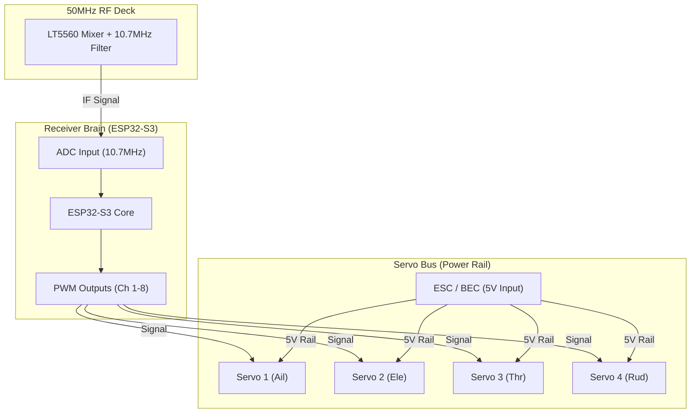

# 6m RC Receiver: Back-End & Servo Connections

This document details the hardware and software required to turn the 50MHz RF signal into physical control for your airplane's servos.

## 1. Receiver Architecture (Back-End)

After the 10.7MHz IF stage, the signal is demodulated by the MCU (ESP32 or STM32). The MCU then generates **PWM (Pulse Width Modulation)** signals for the servos.

### 1.1 MCU Choice: ESP32-S3
The ESP32-S3 is recommended for the receiver because:
- **High Speed**: Dual-core 240MHz is plenty for SDR demodulation.
- **PWM Peripherals**: The `MCPWM` (Motor Control PWM) hardware is perfect for generating jitter-free servo signals.
- **Tiny Form Factor**: Available in small modules (ESP32-S3-WROOM-1) suitable for aircraft.

---

## 2. Servo Connection Schematic

Standard RC servos use a 3-pin connector: **GND, 5V (VCC), and Signal (PWM)**.

### 2.1 Wiring Diagram


### 2.2 Servo Pin Mapping (ESP32)
| Channel | Function | ESP32 Pin | Note |
| :--- | :--- | :--- | :--- |
| **CH 1** | Aileron | GPIO 4 | 50Hz PWM, 1000-2000us |
| **CH 2** | Elevator | GPIO 5 | 50Hz PWM |
| **CH 3** | Throttle | GPIO 6 | Connects to ESC Signal |
| **CH 4** | Rudder | GPIO 7 | 50Hz PWM |
| **CH 5** | Aux 1 | GPIO 15 | Gear / Flaps |

---

## 3. Power Management (The Servo Bus)

**CRITICAL**: Servos draw significant current (up to 2A during stalls). Do **NOT** power servos directly from the ESP32's 3.3V regulator.

1.  **Common Rail**: Create a high-current 5V rail (the "Servo Bus") on your PCB.
2.  **BEC Input**: Use the 5V output from your Electronic Speed Controller (ESC) to power this rail.
3.  **Isolation**: Add a large capacitor (470uF - 1000uF) on the 5V rail to prevent voltage dips (Brown-outs) when servos move rapidly, which could reset the ESP32.

---

## 4. PWM Firmware (ESP32 C++ Snippet)

Using the ESP32 `ESP32Servo` library for easy implementation.

```cpp
#include <ESP32Servo.h>

Servo aileron;
Servo elevator;

void setup() {
    // Standard RC PWM: 50Hz, 1000us min, 2000us max
    aileron.attach(4, 1000, 2000); 
    elevator.attach(5, 1000, 2000);
}

void updateServos(int ail_val, int ele_val) {
    // ail_val and ele_val are decoded from the 50MHz radio link
    aileron.writeMicroseconds(ail_val);
    elevator.writeMicroseconds(ele_val);
}
```

---

## 5. Physical Layout Recommendation
- **Servo Headers**: Use standard 3-pin 0.1" (2.54mm) male headers arranged in a row.
- **Antenna**: A 1.5m thin wire (28AWG) trailing from the plane. Ensure it is routed away from the servo wires to minimize interference.

---
*Created for the 50MHz Ham Band RC Project.*
