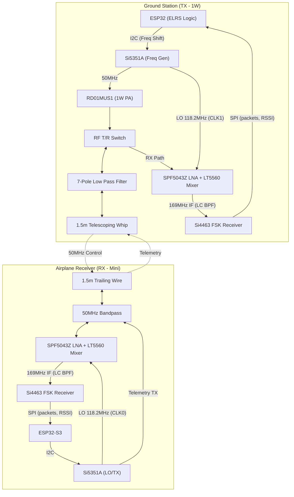

# 6m (50MHz) Amateur Radio RC Transceiver Design

This document details the design for a modern, high-performance 2-way digital radio control and telemetry system operating in the 50MHz (6-meter) Amateur Radio band.

## 1. Project Overview
- **Frequency Band**: 50.0 – 54.0 MHz (Target: 50.8 – 51.0 MHz RC Window).
- **Communication Type**: 2-Way Digital Link (Control + Telemetry).
- **Modulation**: GFSK (Gaussian Frequency Shift Keying).
- **Architecture**: Si5351A carrier/LO + LT5560 upconverting mixer + **Si4463** FSK receiver (6m upconverted to a ~169MHz IF) - all in-production parts. (Revised 2026-09-28: replaces the SA612 / 10.7MHz IF / software-demod receiver.)

---

## 2. System Architecture

---

## 3. Key Components

### 3.1 RF & Logic
| Component | Part Number | Role | Description |
| :--- | :--- | :--- | :--- |
| **Frequency Gen** | [Si5351A-B-GT](https://www.silabs.com/timing/clock-generators/si5351-any-frequency-i2c-programmable-clock-generator) | TX & LO | Generates 50MHz carrier and handles FSK modulation via I2C register pulling. |
| **Power Amp** | [RD01MUS1](https://www.mitsubishielectric.com/semiconductors/content/product/highfrequency/rfmosfet/rd01mus1.pdf) | TX Boost | 1W VHF Silicon MOSFET. Provides robust range for the ground link. |
| **Mixer** | LT5560 | Receiver (both boards) | Active mixer, used as an **upconverter**: 50MHz + 118.2MHz LO -> ~169MHz IF. Replaces the SA612AD. |
| **FSK Receiver** | Si4463-C2A-GM | Receiver (both boards) | Silicon Labs EZRadioPRO, 142-1050MHz, receive-only here. Hardware 2FSK demod, AFC, preamble/sync detect, FIFO, RSSI; ESP32 reads packets over SPI. |
| **LNA** | [SPF5043Z](https://www.qorvo.com/products/p/SPF5043Z) | Front-End | Low-noise amplifier to maximize sensitivity. |

### 3.2 Microcontrollers
- **Ground Station**: **ESP32-S3**. Powerful enough to run the ExpressLRS (ELRS) stack, with integrated WiFi for smartphone configuration and firmware updates.
- **Airplane RX**: **ESP32-S3**. Reads demodulated packets from the Si4463 over SPI and drives the servos; no IF sampling or software demodulation. (The STM32L412 / software-demod plan is superseded.)

---

## 4. Design Specifics

### 4.1 FSK Modulation Technique
The Si5351A is modulated by the MCU updating the `MSx_P1`, `MSx_P2`, and `MSx_P3` registers over I2C.
- **Center Frequency**: 50.800 MHz.
- **Deviation**: ±5 kHz (project standard; older docs said ±2.4 kHz). Must match the Si4463 receiver configuration.
- **Update Rate**: For a 2400 baud link, the registers should be updated at approximately 10kHz to ensure smooth frequency transitions (GFSK).

### 4.2 Receiver Intermediate Frequency (IF)
Both receivers (airplane RX and the ground station's telemetry receiver) use single-conversion **upconversion** into an Si4463, which doesn't tune down to 50MHz (range 142-1050MHz):
- **RF Input**: 50.100 - 51.000 MHz (RC channels 50.800 - 50.980 MHz).
- **Local Oscillator (LO)**: **118.200 MHz, fixed** (Si5351A; RX board CLK0, TX board CLK1, on a separate PLL from the FSK carrier).
- **IF**: IF = RF + LO (sum mixing, no spectral inversion) -> **168.300 - 169.200 MHz** (RC channels at 169.000 - 169.180 MHz).
- **Selectivity**: 3-pole LC band-pass at ~168.75MHz (~3-5MHz BW) rejects LO/RF feedthrough; the Si4463's channel filter provides the narrow selectivity. Image (~287MHz) and the 2xRF-LO response (~143.6MHz) are rejected by the 50MHz BPF.
- **Demodulation**: in the Si4463 (2FSK, AFC enabled -- worst-case frequency error ~6.8kHz exceeds the deviation). Frequency hopping changes the Si4463 channel number; the LO stays fixed.
- **Superseded**: the SA612 / 10.7MHz ceramic filter / MCU DSP plan, and the later CD74HC4046A PLL discriminator. The AX5043 (native 50MHz) was rejected as out of production.

### 4.3 1W Power Amplifier (PA)
The RD01MUS1 requires a simple matching network:
- **Input Match**: Typically a 4:1 or 9:1 transformer to match the low input impedance of the MOSFET.
- **Output Match**: A Pi-network or L-network designed for 50 Ohm load at 50MHz.
- **Low Pass Filter**: A 7-pole Butterworth filter is mandatory to suppress the 100MHz (2nd) and 150MHz (3rd) harmonics to >60dBc.

---

## 5. Antennas
- **Airplane (RX)**: 1.5m (59 inches) 1/4 wave trailing wire. Must be routed away from ESCs, motors, and carbon fiber components.
- **Ground Station (TX)**: 1.5m telescoping whip. For maximum performance, include a 1.5m "tiger tail" counterpoise wire connected to the module ground.

---

## 6. Implementation Notes & Best Practices

> [!IMPORTANT]
> **Licensing**: Operating this system requires a valid Amateur Radio License. Ensure your callsign is programmed into the telemetry data packets to comply with "Automatic Identification" regulations.

> [!WARNING]
> **Thermal Management**: The RD01MUS1 at 1W output is roughly 50-60% efficient, meaning it dissipates ~1W of heat. Use a large ground plane and thermal vias on the PCB to wick heat away.

> [!TIP]
> **Firmware**: Modeling the packet structure after **ExpressLRS (ELRS)** is highly recommended. It provides industry-leading latency and interference rejection.

---

## 7. Verification Plan
1. **Spectral Purity**: Verify harmonic emissions are below -60dBc using a spectrum analyzer.
2. **Frequency Stability**: Test the Si5351A and Si4463 crystals over temperature; confirm the combined carrier + LO + Si4463 XO error stays within the Si4463 AFC pull-in range (trim at build if needed).
3. **Range Test**: Conduct a ground-range test. 1W at 50MHz should provide over 10km of line-of-sight range under ideal conditions.
