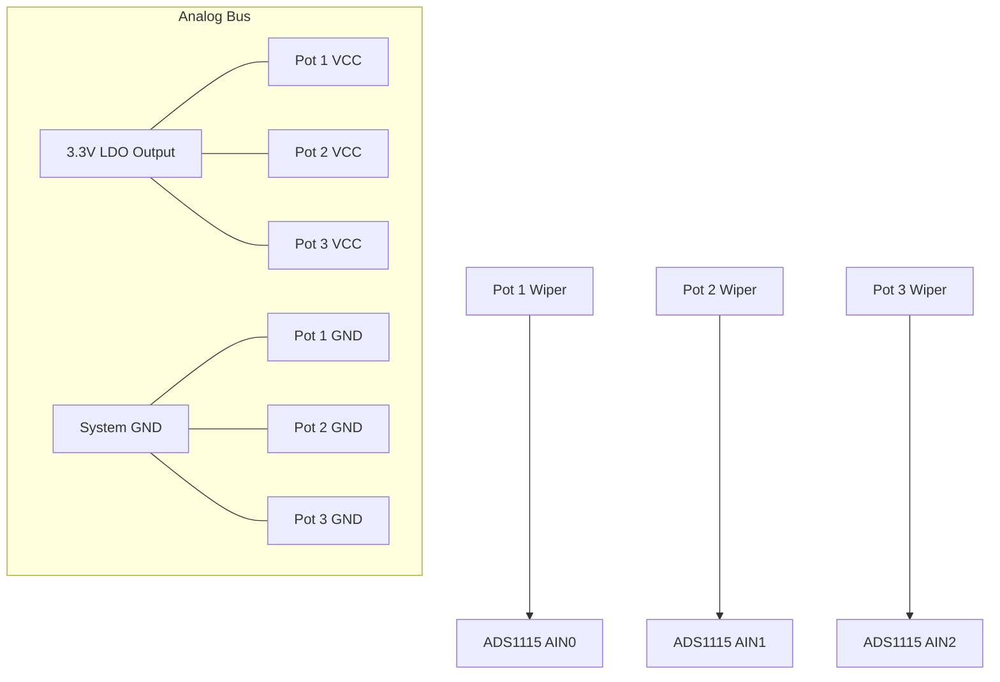

# Kraft 7: Analog Stick & Switch Wiring Harness

This document details the physical connection between the original Kraft joystick potentiometers, auxiliary knobs, and the new ADS1115 ADC.

## 1. Potentiometer Wiring (Standard Kraft)
Most vintage Kraft radios use **5k Ohm** or **10k Ohm** potentiometers. To interface with the 3.3V digital system, we must provide a stable reference voltage.

### 1.1 The Common Analog Bus
To minimize wiring clutter, use a common bus for Power and Ground that daisy-chains between all pots.

| Wire Color (Suggested) | Function | Connection |
| :--- | :--- | :--- |
| **Red** | **VCC (3.3V)** | Pin 1 of ALL Potentiometers |
| **Black** | **GND** | Pin 3 of ALL Potentiometers |
| **White/Yellow** | **Signal (Wiper)**| Pin 2 (Center) to ADC Inputs |

---

## 2. ADC Input Mapping (7 Channels)

To achieve high-resolution across all 7 channels, we use **two ADS1115 modules** on the same I2C bus.

### 2.1 Primary ADC (Address: 0x48) - Main Sticks
| ADC Input | Channel | Function | Kraft Stick Location |
| :--- | :--- | :--- | :--- |
| **AIN0** | 1 | **Aileron** | Right Stick (Horizontal) |
| **AIN1** | 2 | **Elevator** | Right Stick (Vertical) |
| **AIN2** | 3 | **Throttle** | Left Stick (Vertical) |
| **AIN3** | 4 | **Rudder** | Left Stick (Horizontal) |

### 2.2 Secondary ADC (Address: 0x49) - Aux & Trims
*Connect the **ADDR** pin of the second ADS1115 to **VDD** to change its address.*

| ADC Input | Channel | Function | Kraft Location |
| :--- | :--- | :--- | :--- |
| **AIN0** | 5 | **Aux 1** | Top Left Knob/Lever |
| **AIN1** | 6 | **Aux 2** | Top Right Knob/Lever |
| **AIN2** | 7 | **Aux 3** | Side Switch/Slider |
| **AIN3** | 8 | **Battery Sense**| LiPo Voltage Divider |

---

## 3. Physical Connector Suggestion
Since you are rebuilding the "deck," I recommend using **JST-XH (2.54mm)** connectors for the stick assemblies. This allows you to easily remove the sticks for maintenance.

- **4x 3-Pin JST-XH**: One for each main stick axis (VCC, GND, Wiper).
- **3x 3-Pin JST-XH**: For the auxiliary controls.

---

## 4. Wiring Diagram (Schematic View)

---
*Note: If your original Kraft pots are scratchy or have large dead-zones, consider replacing them with modern Hall Effect sensors (e.g., Honeywell SS49E) which connect exactly the same way (VCC, GND, Out).*
