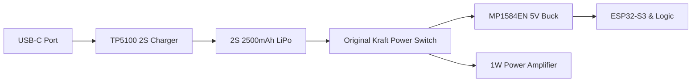

# Kraft 7: Battery Management & LiPo Conversion

This document details the conversion of the vintage Kraft 7 transmitter from NiCd batteries to a modern, safe LiPo system with USB-C charging.

## 1. System Requirements
- **Input Voltage**: 7.4V (2S LiPo) or 11.1V (3S LiPo). *Note: The RD01MUS2 PA performs best at 7.2V - 9.0V.*
- **Charging**: Integrated USB-C charging (no need to open the case).
- **Protection**: Low-voltage cutoff to prevent LiPo damage.

---

## 2. Proposed Power Architecture

---

## 3. Component Selection

| Component | Part Number | Function |
| :--- | :--- | :--- |
| **Battery** | 2S 7.4V LiPo (Flat) | Fits in the original battery compartment. |
| **Charger IC** | **TP5100** | Supports 2S (8.4V) charging from a 12V input. |
| **USB-C Input** | **USB-C Sink PD** | Trigger 12V from a modern USB-C PD brick. |
| **Protection IC**| **HY2120** | 2-Cell Li-ion protection (Overcharge/Over-discharge). |
| **Buck Regulator**| **MP1584EN** | High-efficiency 5V supply for the ESP32. |

---

## 4. Implementation Steps

### 4.1 Safe Charging
- Use a **USB-C PD Trigger board** set to **12V**. This allows you to use standard phone/laptop chargers to charge the radio.
- Feed the 12V into the **TP5100** charger module configured for **2S (8.4V)**.

### 4.2 Voltage Monitoring
- Connect the LiPo (+) through a 100k/10k resistor divider to the **ESP32 GPIO 4**.
- **Firmware**: Program the OLED to display a battery percentage and sound an alarm (piezo) if voltage drops below **6.8V** (3.4V per cell).

### 4.3 Mechanical Integration
- Mount the USB-C port in the original charging jack hole of the Kraft case.
- Ensure the LiPo is securely padded with foam to prevent movement inside the metal case.

---

## 5. Wiring Diagram Summary
1.  **LiPo (+)** -> Protection Board -> Kraft Switch -> PA Drain & Buck Input.
2.  **LiPo (-)** -> Protection Board -> System GND.
3.  **ESP32 3.3V** -> ADS1115 VDD (For stable ADC reference).

---
*Safety Warning: Always use a protected LiPo cell and never leave charging batteries unattended inside a metal case.*
