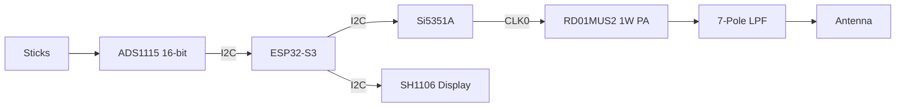

# 50MHz Transmitter: KiCad Schematic Blueprint

## Visual Schematic Reference

This document provides a detailed pin-to-pin mapping for the 1W 50MHz transmitter conversion for the Kraft 7 radio.

## 1. Functional Block Diagram

---

## 2. Component Netlist (Pin-to-Pin)

### 2.1 RF Synthesizer (Modulator)
**IC: Si5351A (MSOP-10)**

| Pin | Name | Connection | Note |
| :--- | :--- | :--- | :--- |
| 1 | VDD | 3.3V | Decouple with 0.1uF |
| 2 | XA | 26MHz Crystal | |
| 3 | XB | 26MHz Crystal | |
| 4 | SCL | ESP32 GPIO 9 | I2C Bus |
| 5 | SDA | ESP32 GPIO 8 | I2C Bus |
| 6 | CLK0 | To PA Input (via 10nF) | RF Drive |

### 2.2 Power Amplifier (PA)
**IC: RD01MUS2 (SOT-89)**

| Pin | Name | Connection | Note |
| :--- | :--- | :--- | :--- |
| 1 | Gate | From Si5351A CLK0 | Match for 50 Ohm |
| 2 | Source | Ground Plane | Thermal Tab |
| 3 | Drain | To LPF (via RFC) | Power feed 7.2V-9.6V |

### 2.3 Precision ADC
**IC: ADS1115 (VSSOP-10)**

| Pin | Name | Connection | Note |
| :--- | :--- | :--- | :--- |
| 1 | ADDR | GND | Sets I2C Address |
| 2 | ALRT | NC | |
| 3 | GND | GND | |
| 4 | AIN0 | Stick: Aileron | Wiper of 5k Pot |
| 5 | AIN1 | Stick: Elevator | Wiper of 5k Pot |
| 6 | AIN2 | Stick: Throttle | Wiper of 5k Pot |
| 7 | AIN3 | Stick: Rudder | Wiper of 5k Pot |
| 8 | VDD | 3.3V | |
| 9 | SDA | ESP32 GPIO 8 | I2C Bus |
| 10 | SCL | ESP32 GPIO 9 | I2C Bus |

---

## 3. Power Amplifier Biasing & Matching

### 3.1 Input Matching (Si5351A to RD01)
- **C1**: 10 nF (DC Block)
- **L1**: 150 nH (Series Inductor for Gate Match)

### 3.2 Output Matching & LPF
- **RFC**: 1.0 uH (0805 Power Inductor to V_BATT)
- **7-Pole LPF (50MHz Cutoff)**:
    - **C values**: 120pF, 220pF, 220pF, 120pF.
    - **L values**: 180nH, 180nH, 180nH.

---

## 4. Power Rails

| Net Name | Voltage | Source | Destination |
| :--- | :--- | :--- | :--- |
| **V_BATT** | 7.4V - 9.6V | 2S/3S LiPo | PA Drain (RFC) |
| **5V** | 5.0V | Buck Converter | ESP32 Vin |
| **3.3V** | 3.3V | ESP32 Regulator | ADS1115, OLED, Si5351A |

---
*Created for the Kraft 7 "Restomod" Project.*
