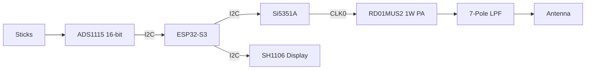

# 50MHz Transmitter: KiCad Schematic Blueprint

## Visual Schematic Reference

This document provides a detailed pin-to-pin mapping for the 1W 50MHz transmitter conversion for the Kraft 7 radio.

## 1. Functional Block Diagram

---

## 2. Component Netlist (Pin-to-Pin)

### 2.1 RF Synthesizer (Modulator)
**IC: Si5351A (MSOP-10)**

| Pin | Name | Connection | Note |
| :--- | :--- | :--- | :--- |
| 1 | VDD | 3.3V | Decouple with 0.1uF |
| 2 | XA | 26MHz Crystal | |
| 3 | XB | 26MHz Crystal | |
| 4 | SCL | ESP32 GPIO 9 | I2C Bus |
| 5 | SDA | ESP32 GPIO 8 | I2C Bus |
| 6 | CLK0 | To PA Input (via 10nF) | RF Drive |

### 2.2 Power Amplifier (PA)
**IC: RD01MUS2 (SOT-89)**

| Pin | Name | Connection | Note |
| :--- | :--- | :--- | :--- |
| 1 | Gate | From Si5351A CLK0 | Match for 50 Ohm |
| 2 | Source | Ground Plane | Thermal Tab |
| 3 | Drain | To LPF (via RFC) | Power feed 7.2V-9.6V |

### 2.3 Precision ADC (Main Sticks)
**IC: ADS1115 (VSSOP-10) - Address 0x48**

| Pin | Name | Connection | Note |
| :--- | :--- | :--- | :--- |
| 1 | ADDR | GND | Sets I2C Address 0x48 |
| 4 | AIN0 | [J1] Pin 2 | Aileron Wiper |
| 5 | AIN1 | [J2] Pin 2 | Elevator Wiper |
| 6 | AIN2 | [J3] Pin 2 | Throttle Wiper |
| 7 | AIN3 | [J4] Pin 2 | Rudder Wiper |
| 8 | VDD | 3.3V | |

### 2.4 Precision ADC (Aux Channels)
**IC: ADS1115 (VSSOP-10) - Address 0x49**

| Pin | Name | Connection | Note |
| :--- | :--- | :--- | :--- |
| 1 | ADDR | VDD | Sets I2C Address 0x49 |
| 4 | AIN0 | [J5] Pin 2 | Aux Channel 5 |
| 5 | AIN1 | [J6] Pin 2 | Aux Channel 6 |
| 6 | AIN2 | [J7] Pin 2 | Aux Channel 7 |
| 7 | AIN3 | Voltage Divider | Battery Monitoring |

### 2.5 Analog Connectors (J1 - J7)
**Type: 3-Pin JST-XH 2.54mm**

| Pin | Name | Connection |
| :--- | :--- | :--- |
| 1 | VCC | 3.3V Analog Bus |
| 2 | Wiper | To ADC AINx |
| 3 | GND | Analog Ground |

### 2.6 Power & Utility Connectors (J8 - J10)

**J8: Battery Input (2-Pin JST-VH or XT30)**
| Pin | Name | Connection | Note |
| :--- | :--- | :--- | :--- |
| 1 | V_BATT | From Kraft Power Switch | 7.4V - 9.6V |
| 2 | GND | System Ground | |

**J9: 5V Logic Power (2-Pin JST-XH)**
| Pin | Name | Connection | Note |
| :--- | :--- | :--- | :--- |
| 1 | 5V_IN | From Buck Converter Out | Powers ESP32 Vin |
| 2 | GND | System Ground | |

**J10: I2C Expansion / OLED (4-Pin JST-XH)**
| Pin | Name | Connection | Note |
| :--- | :--- | :--- | :--- |
| 1 | VCC | 3.3V Logic | |
| 2 | GND | Ground | |
| 3 | SCL | ESP32 GPIO 9 | |
| 4 | SDA | ESP32 GPIO 8 | |

---

## 3. Power Amplifier Biasing & Matching

### 3.1 Input Matching (Si5351A to RD01)
- **C1**: 10 nF (DC Block)
- **L1**: 150 nH (Series Inductor for Gate Match)

### 3.2 Output Matching & LPF
- **RFC**: 1.0 uH (0805 Power Inductor to V_BATT)
- **7-Pole LPF (50MHz Cutoff)**:
    - **C values**: 120pF, 220pF, 220pF, 120pF.
    - **L values**: 180nH, 180nH, 180nH.

---

## 4. Power Rails

| Net Name | Voltage | Source | Destination |
| :--- | :--- | :--- | :--- |
| **V_BATT** | 7.4V - 9.6V | 2S/3S LiPo | PA Drain (RFC) |
| **5V** | 5.0V | Buck Converter | ESP32 Vin |
| **3.3V** | 3.3V | ESP32 Regulator | ADS1115, OLED, Si5351A |

---
*Created for the Kraft 7 "Restomod" Project.*
