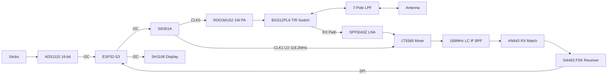

# 50MHz Transmitter: KiCad Schematic Blueprint

## Visual Schematic Reference

This document provides a detailed pin-to-pin mapping for the 1W 50MHz transmitter conversion for the Kraft 7 radio.

## 1. Functional Block Diagram

```mermaid
graph LR
    STX[Sticks] --> ADC[ADS1115 16-bit]
    ADC -- I2C --> ESP[ESP32-S3]
    ESP -- I2C --> SI[Si5351A]
    ESP -- I2C --> OLED[SH1106 Display]
    SI -- CLK0 --> PA[RD01MUS2 1W PA]
    PA --> SW[BGS12PL6 T/R Switch]
    SW <--> LPF[7-Pole LPF]
    LPF <--> ANT[Antenna]
    SW -- RX Path --> LNA[SPF5043Z LNA]
    LNA --> MIX[LT5560 Mixer]
    SI -- "CLK1 LO 118.2MHz" --> MIX
    MIX --> IF["169MHz LC IF BPF"]
    IF --> MATCH["AN643 RX Match"]
    MATCH --> SI44["Si4463 FSK Receiver"]
    SI44 -- SPI --> ESP
```

> **Telemetry receiver revised 2026-09-28:** the 10.7MHz IF filter -> ESP32 ADC path is replaced
> by upconversion to a ~169MHz IF (IF = RF + LO, LO fixed at 118.2MHz) and an **Si4463-C2A-GM**
> FSK receiver on SPI. See `RX_Hardware/RX_Design_Details.md` for the rationale and frequency
> plan -- the TX board's telemetry receiver is the same chain as the RX board's. The KiCad
> schematic carries this chain as of 2026-09-28; the PCB is not yet updated (see
> `KiCad_Projects/TX_50MHz_1W/work_instructions.md`).

---

## 2. Component Netlist (Pin-to-Pin)

### 2.1 RF Synthesizer (Modulator)
**IC: Si5351A (MSOP-10)**

| Pin | Name | Connection | Note |
| :--- | :--- | :--- | :--- |
| 1 | VDD | 3.3V | Decouple with 0.1uF |
| 2 | XA | 26MHz Crystal | |
| 3 | XB | 26MHz Crystal | |
| 4 | SCL | ESP32 GPIO 9 | I2C Bus |
| 5 | SDA | ESP32 GPIO 8 | I2C Bus |
| 6 | CLK0 | To PA Input (via 10nF) | RF Drive (FSK carrier, **PLLA**) |
| 7 | CLK1 | To LT5560 Pin 7 (LO+) | **118.200 MHz fixed LO on PLLB** (PLL 709.2MHz, MS /6) |

CLK0 and CLK1 must be on **separate PLLs** so the I2C frequency steps that make the FSK on
CLK0 never disturb the telemetry-receive LO on CLK1.

### 2.2 Power Amplifier (PA)
**IC: RD01MUS2 (SOT-89)**

| Pin | Name | Connection | Note |
| :--- | :--- | :--- | :--- |
| 1 | Gate | From Si5351A CLK0 | Match for 50 Ohm |
| 2 | Source | Ground Plane | Thermal Tab |
| 3 | Drain | To Switch RF1 (via RFC) | Power feed 7.2V-9.6V |

### 2.3 RF T/R Switch
**IC: BGS12PL6 (TSLP-6)**

| Pin | Name | Connection | Note |
| :--- | :--- | :--- | :--- |
| 1 | RF2 | To Telemetry LNA Input | RX Path (Telemetry) |
| 2 | GND | Ground Plane | |
| 3 | RF1 | From PA Output (Drain) | TX Path (Control) |
| 4 | CTRL | ESP32 GPIO (TR_SW) | High = TX, Low = RX |
| 5 | ANT | To LPF Input | Shared Port |
| 6 | VDD | 3.3V Rail | Decouple with 0.1uF |

### 2.4 Telemetry Receiver Stage
**ICs: SPF5043Z (LNA) & LT5560 (Mixer)**

| Stage | Component | Connection | Note |
| :--- | :--- | :--- | :--- |
| **LNA In** | SPF5043Z Pin 1| From Switch RF2 | 50MHz Input |
| **Mixer RF**| LT5560 Pin 1 | From LNA Output | |
| **Mixer LO**| LT5560 Pin 7 | From Si5351A CLK1 | Local Oscillator, 118.2MHz fixed |
| **Mixer IF**| LT5560 Pin 5 | To 169MHz IF BPF | IF = RF + LO (168.3-169.2MHz); output network tuned for 169MHz, both outputs need a DC path to VCC |
| **IF BPF** | 3-pole LC | To Si4463 RX match | Centre ~168.75MHz, ~3-5MHz BW, 50 Ohm; values TBD (SPICE) |
| **RX Match** | AN643 network | To Si4463 RXp/RXn | Single-ended -> differential LNA match, 169MHz values |
| **Receiver** | Si4463 | SPI to ESP32 | Replaces the 10.7MHz SFE filter (FL1) -> ESP32 ADC (IO10 `ADC_IN`) path |

Frequency hopping on receive is done by the Si4463 channel number; the LO stays fixed.

### 2.4a Telemetry FSK Receiver
**IC: Si4463-C2A-GM (QFN-20 4x4mm + EP)** -- KiCad `RF:Si4463`, footprint
`Package_DFN_QFN:QFN-20-1EP_4x4mm_P0.5mm_EP2.6x2.6mm_ThermalVias`. Receive-only.

| Pin | Name | Connection | Note |
| :--- | :--- | :--- | :--- |
| 1 | SDN | ESP32 GPIO 17 (SI_SDN) | High = shutdown; drive low to run |
| 2 | RXp | From IF BPF via AN643 match | |
| 3 | RXn | From IF BPF via AN643 match | |
| 4 | TX | Not Connected | Receive-only, never enter TX state |
| 5 | NC | Not Connected | |
| 6, 8 | VDD | 3.3V Rail | 100nF + 1uF each (+10pF at pin 8) |
| 7 | TXRAMP | Not Connected | |
| 9 | GPIO0 | Test point (optional RX_STATE) | |
| 10 | GPIO1 | Optional CTS | Can poll CTS over SPI instead |
| 11 | nIRQ | ESP32 GPIO 16 (SI_nIRQ) | Open-drain, 10k pull-up to 3.3V |
| 12 | SCLK | ESP32 GPIO 12 | SPI SCK (GPIO matrix), <=10MHz, mode 0 |
| 13 | SDO | ESP32 GPIO 14 | SPI MISO |
| 14 | SDI | ESP32 GPIO 13 | SPI MOSI |
| 15 | nSEL | ESP32 GPIO 15 | SPI CS |
| 16, 17 | XOUT, XIN | 30.000MHz Crystal | Internal tunable load caps; no external caps |
| 18, EP | GND | Ground Plane | Via-stitch the exposed pad |

TX-board SPI pins are **proposed** (IO10 = old `ADC_IN`, IO11 = T/R switch CTRL are taken by the
current netlist; IO10 is freed once the ADC path is removed) -- confirm against the schematic.

### 2.5 Precision ADC (Main Sticks)
**IC: ADS1115 (VSSOP-10) - Address 0x48**

| Pin | Name | Connection | Note |
| :--- | :--- | :--- | :--- |
| 1 | ADDR | GND | Sets I2C Address 0x48 |
| 4 | AIN0 | [J1] Pin 2 | Aileron Wiper |
| 5 | AIN1 | [J2] Pin 2 | Elevator Wiper |
| 6 | AIN2 | [J3] Pin 2 | Throttle Wiper |
| 7 | AIN3 | [J4] Pin 2 | Rudder Wiper |
| 8 | VDD | 3.3V | |

### 2.6 Precision ADC (Aux Channels)
**IC: ADS1115 (VSSOP-10) - Address 0x49**

| Pin | Name | Connection | Note |
| :--- | :--- | :--- | :--- |
| 1 | ADDR | VDD | Sets I2C Address 0x49 |
| 4 | AIN0 | [J5] Pin 2 | Aux Channel 5 |
| 5 | AIN1 | [J6] Pin 2 | Aux Channel 6 |
| 6 | AIN2 | [J7] Pin 2 | Aux Channel 7 |
| 7 | AIN3 | Voltage Divider | Battery Monitoring |

### 2.7 Analog Connectors (J1 - J7)
**Type: 3-Pin JST-XH 2.54mm**

| Pin | Name | Connection |
| :--- | :--- | :--- |
| 1 | VCC | 3.3V Analog Bus |
| 2 | Wiper | To ADC AINx |
| 3 | GND | Analog Ground |

### 2.8 Power & Utility Connectors (J8 - J10)

**J8: Battery Input (2-Pin JST-VH or XT30)**
| Pin | Name | Connection | Note |
| :--- | :--- | :--- | :--- |
| 1 | V_BATT | From Kraft Power Switch | 7.4V - 9.6V |
| 2 | GND | System Ground | |

**J9: 5V Logic Power (2-Pin JST-XH)**
| Pin | Name | Connection | Note |
| :--- | :--- | :--- | :--- |
| 1 | 5V_IN | From Buck Converter Out | Powers ESP32 Vin |
| 2 | GND | System Ground | |

**J10: I2C Expansion / OLED (4-Pin JST-XH)**
| Pin | Name | Connection | Note |
| :--- | :--- | :--- | :--- |
| 1 | VCC | 3.3V Logic | |
| 2 | GND | Ground | |
| 3 | SCL | ESP32 GPIO 9 | |
| 4 | SDA | ESP32 GPIO 8 | |

---

## 3. Power Amplifier Biasing & Matching

### 3.1 Input Matching (Si5351A to RD01)
- **C1**: 10 nF (DC Block)
- **L1**: 150 nH (Series Inductor for Gate Match)

### 3.2 Output Matching & LPF
- **RFC**: 1.0 uH (0805 Power Inductor to V_BATT)
- **7-Pole LPF (50MHz Cutoff)**:
    - **C values**: 120pF, 220pF, 220pF, 120pF.
    - **L values**: 180nH, 180nH, 180nH.

---

## 4. Power Rails

| Net Name | Voltage | Source | Destination |
| :--- | :--- | :--- | :--- |
| **V_BATT** | 7.4V - 9.6V | 2S/3S LiPo | PA Drain (RFC) |
| **5V** | 5.0V | Buck Converter | ESP32 Vin |
| **3.3V** | 3.3V | ESP32 Regulator | ADS1115, OLED, Si5351A, LT5560, Si4463 |

---
*Created for the Kraft 7 "Restomod" Project.*
